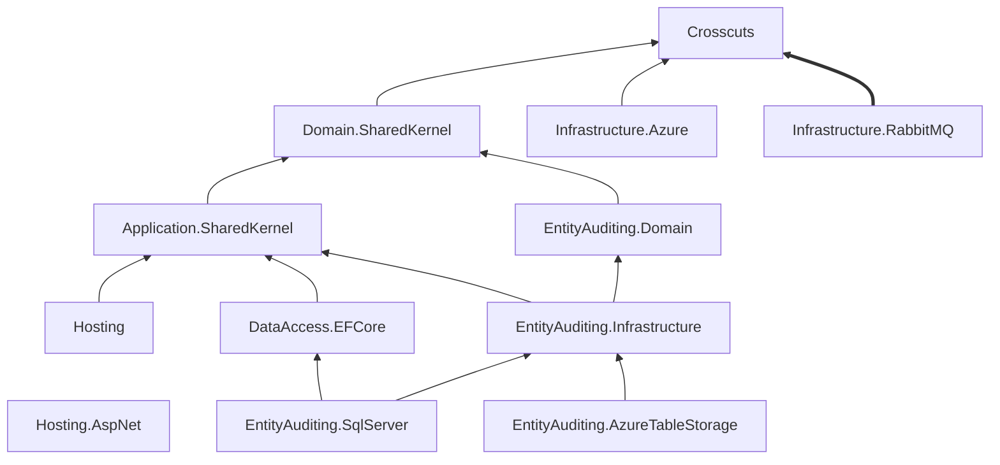

  

# One Beyond Studio Core libraries dependencies

```mermaid
 graph BT;
 B[Domain.SharedKernel] --> A[Crosscuts];
 C[Application.SharedKernel] --> B[Domain.SharedKernel];
 I[Infrastructure.Azure] --> A[Crosscuts];
 N[Hosting] --> C[Application.SharedKernel]
 D[DataAccess.EFCore] --> C[Application.SharedKernel];
 O[Hosting.AspNet]
 J[EntityAuditing.Domain] --> B[Domain.SharedKernel];
 K[EntityAuditing.Infrastructure] --> J[EntityAuditing.Domain];
 K[EntityAuditing.Infrastructure] --> C[Application.SharedKernel];
 L[EntityAuditing.SqlServer] --> K[EntityAuditing.Infrastructure];
 L[EntityAuditing.SqlServer] --> D[DataAccess.EFCore];
 M[EntityAuditing.AzureTableStorage] --> K[EntityAuditing.Infrastructure];
 P[Infrastructure.RabbitMQ] ==> A[Crosscuts];
```
