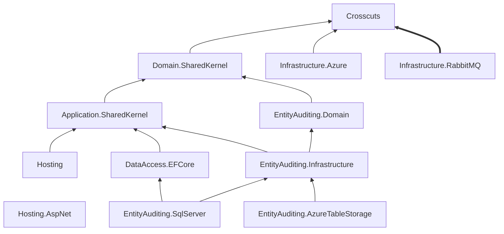

  

# Introduction
Beyond Studio Core is a set of .NET libraries that can be used by developers to create their solutions based on Clean Architecture.
One of the examples on how these libraries can be used in a project can be found [here](https://github.com/onebeyond/onebeyond-studio-obelisk).

# Getting Started

### Supported .NET version:

7.0

# Documentation

For more detailed documentation, please refer to our [Wiki](https://github.com/onebeyond/onebeyond-studio-core/wiki)

# Contributing

If you want to contribute, we are currently accepting PRs and/or proposals/discussions in the issue tracker.

# One Beyond Studio Core Libraries Dependencies

